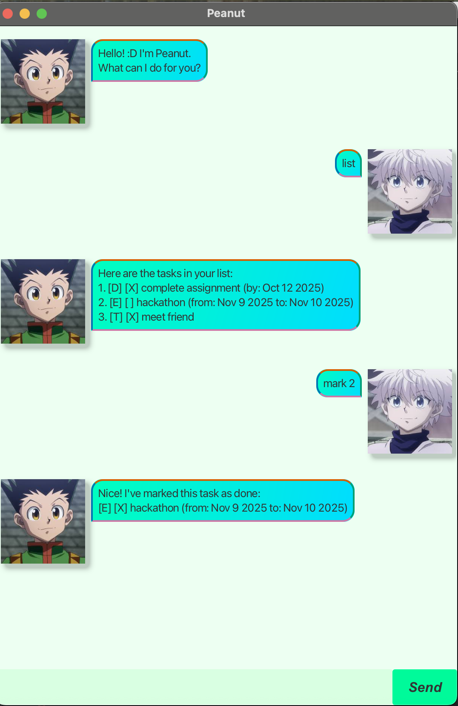

# Peanut User Guide



Welcome to Peanut!! Peanut is a task management app that helps you keep track of all your tasks.

You can add different kinds of tasks, mark them as done, list them and much more, all from the comfort of your terminal.


## Adding ToDo

You can add a task without any time by typing:

Example: `todo submit assignment`


```
Got it. I've added this task:
[T][ ] submit assignment
Now you have 1 task in the list.
```


## Adding Deadline

You can add a task with a deadline by typing:

Example: `deadline submit report /by 2025-09-20`


```
Got it. I've added this task:
[D][ ] submit report (by: Sep 20 2025)
Now you have 2 tasks in the list.
```

## Adding Event

You can add a event tasks with start and end dates by typing:

Example: `event hackathon /from 2025-09-20 /to 2025-09-21`


```
Got it. I've added this task:
[E][ ] project meeting (from: Sep 21 2025 to: Sep 22 2025)
Now you have 3 tasks in the list.
```

## List

You can view all your tasks by typing:

Example: `list`

```
Here are the tasks in your list:
[T][ ] submit assignment
[D][ ] submit report (by: Sep 20 2025)
[E][ ] project meeting (from: Sep 21 2025 to: Sep 22 2025)
```

## Mark

You can mark your tasks by typing:

Example: `mark 1`

```
Nice! I've marked this task as done:
[D][X] submit report (by: Sep 20 2025)
```

## Unmark

You can unmark your tasks by typing:

Example: `unmark 1`

```
Ok! I've marked this task as not done yet:
[D][] submit report (by: Sep 20 2025)
```
## Archive

You can archive your tasks by typing:

Example: `archive`

This will save your current list into a text file in the data folder (archive-date-time.txt)

```
TaskList successfully archived, TaskList has been cleared!!
```
## Delete

You can delete your tasks by typing:

Example: `delete 2`


```
Noted. I've removed this task:
[D][] submit report (by: Sep 20 2025)
Now you have 2 tasks in the list.

```
## Find

You can search for your tasks by typing:

Example: `find submit`


```
Here are the matching tasks:
[D][] submit report (by: Sep 20 2025)
```
## Exit

You can exit the GUI by typing:

Example: `bye`


```
"Bye. Hope to see you again soon!"
```
<p align="center" style="color:pink; font-size:18px;">
  Hope you have a great time using <b>Peanut</b> :D
</p>


